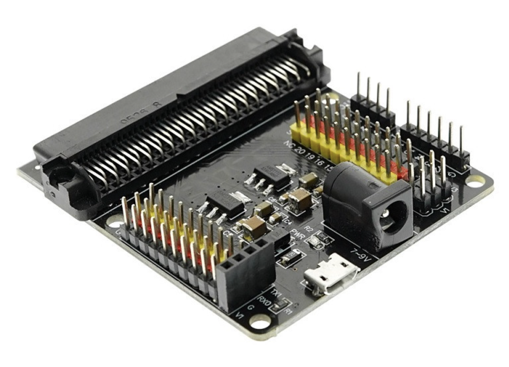
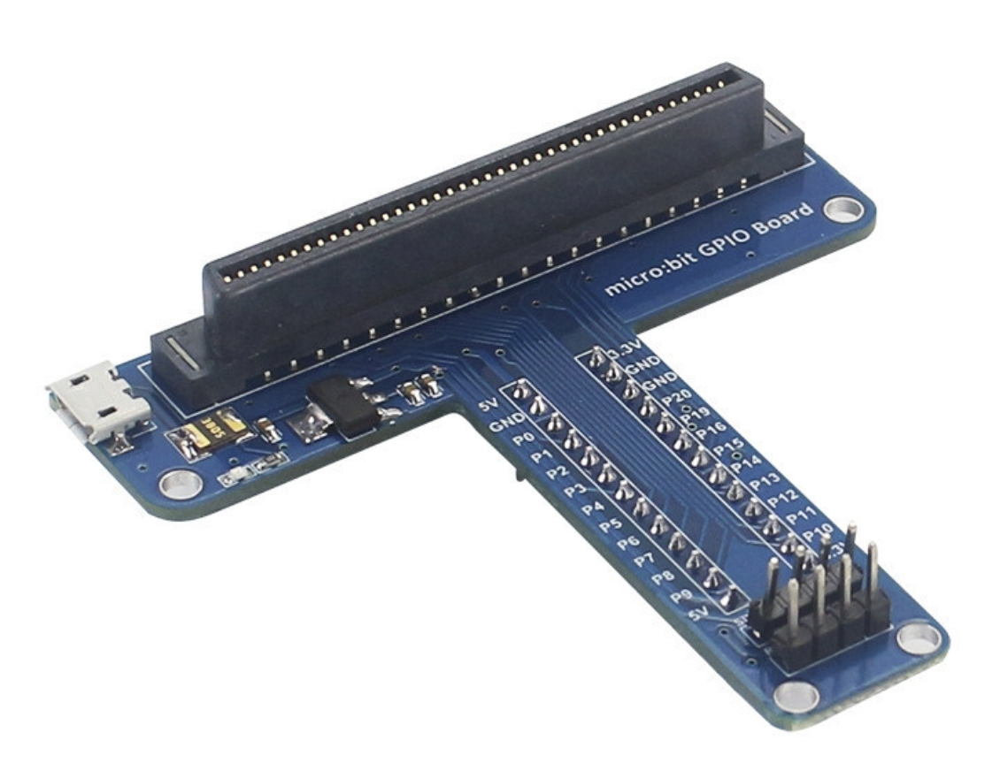
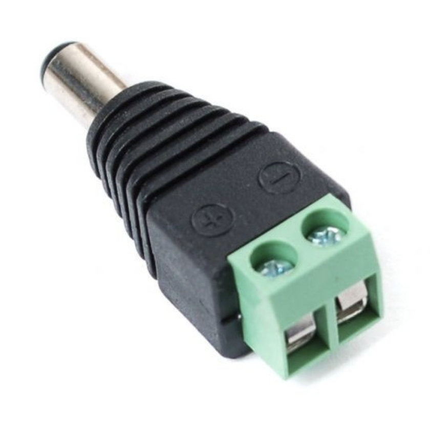
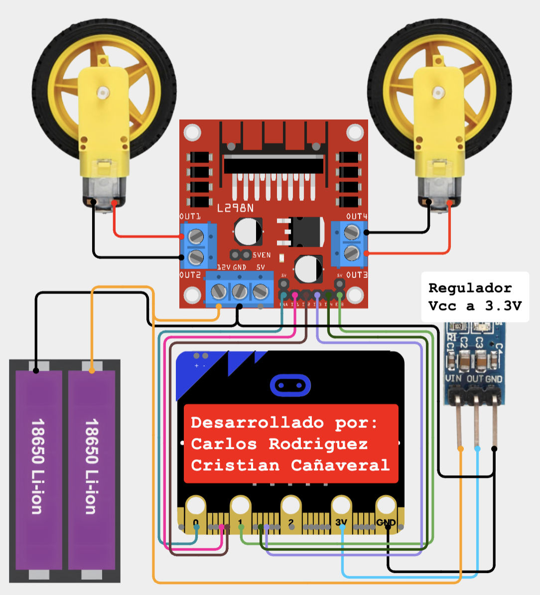
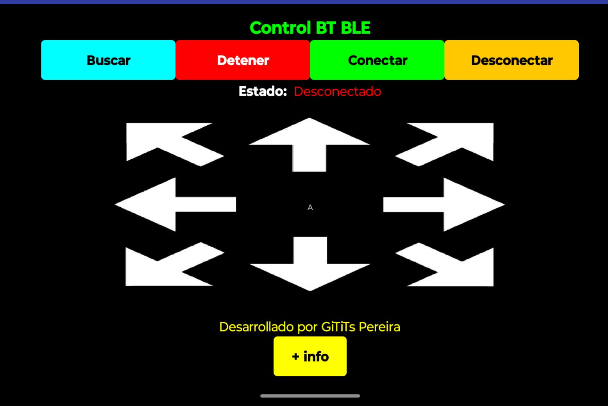

# Carro Bluetooth con Microbit
Proyecto para controlar una Microbit de forma inalámbrica a través de una aplicación de Android con bluetooth LE.

## Componentes necesarios
* Microbit
* Tarjeta de expansión para Microbit Regulada (Que tenga regulador interno para simplificar la conexión)
* Motorreductores
* Driver L298N (Puente H)
* Batería de 7-9V
* Cables
* Dispositivo móvil con Android

**Nota:** La regulación de la tarjeta de expansión de la Microbit maneja un rango entre 7 a 9 Volts (No debemos exceder este voltaje para evitar daños al regulador o a la Microbit).

## Algunas recomendaciones de hardware:  
### Tarjeta de expansión para Microbit:

### Tarjeta de expansión para Microbit para protoboard:

### Conector Plug con Bornera para la tarjeta de expansión:

---

## Guía de conexión
Este es el diagrama de conexiones para el proyecto:

Sigue los pasos a continuación para un montaje correcto:

#### 1. Conexión de la alimentación y los motores 🔋🚗

* **Baterías al L298N:** Conecta el polo **positivo (+) de la batería** al pin **12V** del módulo L298N. Conecta el polo **negativo (-) de la batería** al pin **GND** del mismo módulo.
* **Motores al L298N:** Conecta los cables del **motor izquierdo** a los pines **OUT1 y OUT2**. Conecta los cables del **motor derecho** a los pines **OUT3 y OUT4**.

#### 2. Conexión del L298N a la Microbit 🧠🔌

* **Pines de control:**
    * Conecta el pin **ENA** del L298N al pin **0** de la Microbit.
    * Conecta el pin **IN1** del L298N al pin **6** de la Microbit.
    * Conecta el pin **IN2** del L298N al pin **7** de la Microbit.
    * Conecta el pin **IN3** del L298N al pin **10** de la Microbit.
    * Conecta el pin **IN4** del L298N al pin **9** de la Microbit.
    * Conecta el pin **ENB** del L298N al pin **1** de la Microbit.
* **Pines de alimentación:** Conecta el pin **12V** del driver L298N al terminal positivo **(+)** de la bornera del plug y el pin **GND** del L298N al terminal negativo **(-)** bornera del plug.

**Nota:** La regulación de la tarjeta de expansión de la Microbit maneja un rango entre 7 a 9 Volts (No debemos exceder este voltaje para evitar daños al regulador o a la Microbit).

#### 3. (Opcional) - Conexión con regulador externo
En caso de no contar con la placa de extensión de pines para la Microbit, se hace necesario utilizar un regulador de voltaje para alimentar la Microbit.  

---

## Código para Microbit

### Carga del Código en el Explorador de archivos (Windows) o Finder (MacOs) 👨‍💻

1. **Conecta la Microbit a tu computadora:** Usa el cable USB para conectar el puerto micro-USB de la Microbit a un puerto USB de tu computador.
2. **La Microbit aparecerá como una unidad de disco:** Espera unos segundos. Tu computador reconocerá la Microbit como si fuera una memoria USB. En el explorador de archivos (en Windows) o en el Finder (en Mac), verás un nuevo dispositivo llamado MICROBIT.
3. **Copia el archivo .hex:** Busca el archivo de programa con extensión **.hex** que te he proporcionado en este repositorio. Puedes arrastrar y soltar el archivo directamente sobre la unidad MICROBIT que apareció en el paso anterior.
4. **Espera a que se transfiera el archivo:** Verás una luz LED amarilla o roja parpadeando en la parte posterior de la Microbit. Esto indica que la tarjeta está recibiendo los datos. Es muy importante que no desconectes la tarjeta durante este proceso.
5. **¡Programa cargado!:** Una vez que el LED deje de parpadear y se apague, significa que la transferencia ha terminado. La Microbit se reiniciará automáticamente y el nuevo programa se ejecutará.

**Descarga el archivo .hex para la Microbit aquí:** [MicrobitBTLECarro.hex](MicrobitBTLECarro.hex)

**Nota importante:** Para usuarios mas avanzados, les dejo un enlace del código de la Microbit, para que lo puedan editar y ajustar a sus necesidades. [Enlace del programa en Makecode](https://makecode.microbit.org/S91320-53700-03653-26894)

---

## Aplicación de Android

### Instalación de la Aplicación en Android 📱

Para instalar la aplicación y controlar el proyecto desde tu celular:

1.  **Descarga la APK:** Descarga el archivo de la aplicación `ControlBTLECarro.apk` que se encuentra en este repositorio.
2.  **Habilita fuentes desconocidas:** Ve a la **Configuración** de tu teléfono, busca la opción de **Seguridad y privacidad** y habilita la instalación de aplicaciones de **"Fuentes desconocidas"** o **"Instalar apps de fuentes externas"**. Este paso es necesario para instalar aplicaciones que no provienen de Google Play Store.
3.  **Instala la APK:** Busca el archivo APK que descargaste en la carpeta de descargas de tu teléfono y tócalo para iniciar la instalación y sigue los pasos que allí te indican.
4.  **Abre la aplicación:** Una vez instalada, busca el ícono de la aplicación en la pantalla de inicio y ábrela para empezar a usarla.* 

### Guía de Uso de la Aplicación Móvil 📱

Una vez que hayas instalado la aplicación, sigue estos pasos para conectarte a tu proyecto de Arduino y controlarlo.

1.  **Enciende el Bluetooth y el GPS:** Al abrir la aplicación, un mensaje emergente te pedirá que actives el Bluetooth y el GPS de tu celular. Acepta para continuar.
2.  **Conexión a la Microbit:**
    * Presiona el botón **"Buscar"** para escanear y cargar la lista de dispositivos cercanos.
    * Allí debería desplegarte un listado de dispositivos disponibles.
    * Deberás seleccionar la dirección de tu Microbit y tocar el botón de **"Conectar"**
    * El estado deberá pasar de "Buscando" a "Conectado" en color verde.
    * **Advertencia:** Si te salen varios dispositivos y se te pierde tu Microbit en el listado, puedes tocar el botón **"Detener"** apenas veas tu dispositivo para "congelar" la búsqueda.
3.  **Control del Robot:**
    * Una vez conectado, el robot responderá a las teclas de dirección.
    * **Adelante:** La aplicación envía la letra **B**.
    * **Atrás:** La aplicación envía la letra **C**.
    * **Derecha:** La aplicación envía la letra **D**.
    * **Izquierda:** La aplicación envía la letra **E**.
    * **Detener:** Al dejar de presionar las flechas, la aplicación envía la letra **A** para detener el movimiento.
    * Puedes ver la letra que se está enviando en tiempo real en la parte central de la interfaz.
4.  **Desconexión Segura:**
    * Antes de cerrar la aplicación, es recomendable presionar el botón **"Desconectar"**.
    * Confirma la desconexión observando que el estado cambie de nuevo a **"Desconectado"** (en rojo).

¡Listo! Con estos sencillos pasos, podrán utilizar la aplicación para controlar el robot sin problemas.

---

## Contacto

Cristian Camilo Cañaveral Avilés  
Ing. Mecatrónico  
Email: camilo.canaveral@itspereira.edu.co

Carlos Andrés Rodriguez Pérez  
Ing. Mecatrónico  
Email: carlos.rodriguez@itspereira.edu.co
